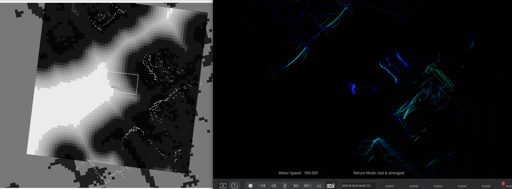
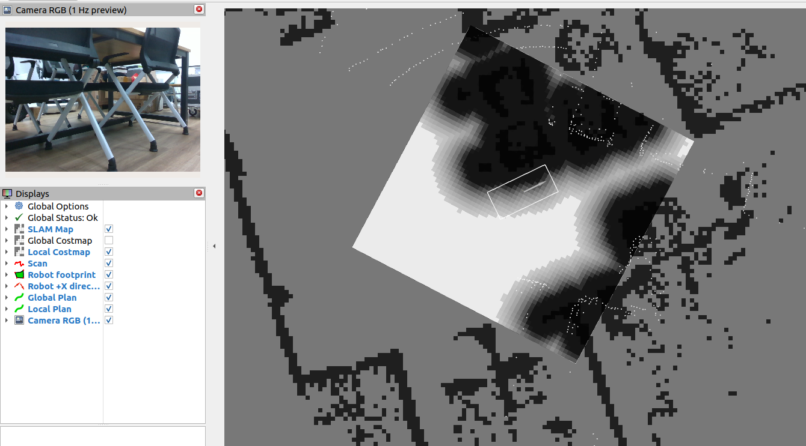

# 扫定地图+AMCL的VLM导航测试日志

## 10.1

将地图扫好保存，让机器狗将实时点云与障碍物地图进行匹配，从而获悉它目前所在位置并提供避障。由于机器狗背后将安装机械臂，根据锐利边缘和物件遮挡导致点云拉丝的问题，将建图和实时点云切除后方120度范围。

当前定位方式为

```txt
  XT16 + IMU
     ↓
  SPARK FAST-LIO
     ├─ odom → base_link
     └─ /cloud_registered_base → /scan
                                ↓
  saved map + AMCL
     └─ map → odom
```

接下来进行了**6次**VLM导航的测试，**成功2次**。

第一次因为离桌子太近，scan goal failed with status 6退出

第二次卡了一下路上的桌脚, 仍能成功来到红色灭火器附近

第三次在标目标时发生跳变，它所指向的目标位置和机器狗方向偏离正确情况：灭火器在左上角白点处，然而由于发生跳变，根据VLM所指位置设置了路径终点在另一个地方（曲线末端），且发生奇异的转向最终停在桌角旁。


第四次点云与地图错配，以为撞到小车并failed with status 6见下图，第五次失败原因类似第三次。



第六次在较空旷的区域测试，虽然有少数次跳变，但能够恢复正常并来到灭火器旁边。

- 第 3 次：17:34:10，VLM 投影到地图中的同一目标位置跳变了 1.581 m，之后又出现 0.448、1.294、0.583 m 的重置。随后 Nav2 连续报告路径/footprint 命中障碍并失败。

- 第 4 次：17:41:47，Nav2 报 Collision Ahead；当时 FAST-LIO 点数正常。17:43:41 以后发生的 116 秒雷达/里程计中断是另一项独立故障，不能用来解释此前的误碰撞判断。
- 第 5 次：目标地图坐标跳变 0.609 m，随后连续出现 ObstacleFootprint/Trajectory Hits Obstacle，最终导航失败。
- 第 3、5 次的 FAST-LIO **odom→base_link 连续**，没有足以解释错配的里程计突跳。结合你看到的点云方向错误且无法恢复，**最可能异常在 AMCL 的 map→odom**：AMCL 收敛到了错误位姿，或发生了持续性的错误修正。
- 当前 AMCL 模式的 local/global costmap 只有 StaticLayer + InflationLayer，因此这些碰撞判断不是实时假点直接写入 costmap，而是错误全局位姿让机器人在静态地图中“落到”了错误位
  置。

调节AMCL baseline的alpha从0.2改为0.1，进行了3次尝试，3次都失败。问题依旧是，1.起点离桌子太近，2.看到目标但是错配标错了地方，导致行踪诡异不知道走到何处去了。

## 10.2

这次让狗在空旷位置开始，将灭火器放在小车这边。

第一次测试，相机看到了门口旁边那个屏幕下面的灭火器并走了过去。

第二次测试在中途路线偏了一点，闭环调整时转身途中VLM抽风一直指点，然后就被判无效了，被门控disarm

```txt
根本原因是当前故障策略存在冲突：

1. `api_failure_limit` 配置为 `3`。
2. 但任意一条无效响应都会先将 `vlm_api_ready=false`。
3. Go2 又启用了 `require_external_safety_gates=true`。
4. 因而第一条错误响应就立即执行：

   disabling VLM task
   → enabled=false
   → reset_task(DISARMED)

5. 随后才记录：
   VLM failure 1/3

```

现修复这个问题，允许VLM可以提供无效响应，连续失败3次。

第三次成功来到灭火器的附近，但是观察到它标记的终点与实际灭火器位置稍有偏移。于是让目标若在视野内时，闭环更新目标在地图上的位置，以减少受到地图匹配噪声带来的偏移。

第四次也是有些偏地走到了灭火器旁，算作成功？

第五次在门口转向时迷失方向，同样以为自己来到障碍中。