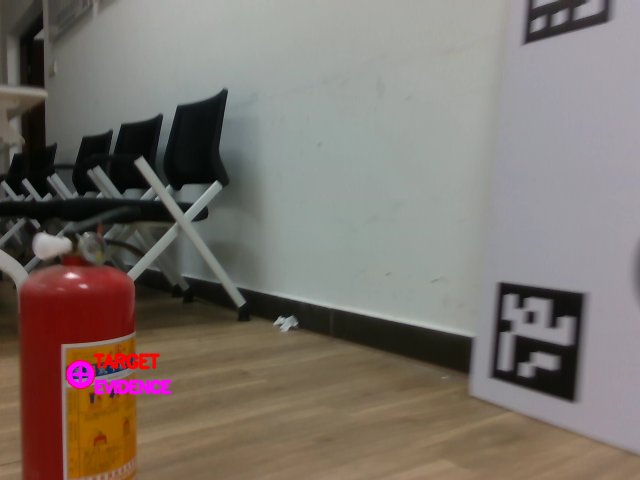

# 9.17

### 第一次测试

第一次按照要求，在狗上启动VLM_Nav, 其中go2_vlm.launch.py的窗口多次出现查询未来消息的警告，最终报错如下后终止。

```txt
[vlm_navigator-2] Traceback (most recent call last):
[vlm_navigator-2]   File "/home/isee-pst/unitree_ros2/go2_ws/install/vlm_nav/lib/vlm_nav/vlm_navigator", line 6, in <module>
[vlm_navigator-2]     main()
[vlm_navigator-2]   File "/home/isee-pst/unitree_ros2/VLM_Nav/vlm_nav/vlm_navigator.py", line 3974, in main
[vlm_navigator-2]     executor.spin()
[vlm_navigator-2]   File "/opt/ros/humble/local/lib/python3.10/dist-packages/rclpy/executors.py", line 323, in spin
[vlm_navigator-2]     self.spin_once()
[vlm_navigator-2]   File "/opt/ros/humble/local/lib/python3.10/dist-packages/rclpy/executors.py", line 863, in spin_once
[vlm_navigator-2]     self._spin_once_impl(timeout_sec)
[vlm_navigator-2]   File "/opt/ros/humble/local/lib/python3.10/dist-packages/rclpy/executors.py", line 860, in _spin_once_impl
[vlm_navigator-2]     future.result()
[vlm_navigator-2]   File "/opt/ros/humble/local/lib/python3.10/dist-packages/rclpy/task.py", line 109, in result
[vlm_navigator-2]     raise self.exception()
[vlm_navigator-2]   File "/opt/ros/humble/local/lib/python3.10/dist-packages/rclpy/task.py", line 272, in _execute_coroutine_step
[vlm_navigator-2]     result = coro.send(None)
[vlm_navigator-2]   File "/opt/ros/humble/local/lib/python3.10/dist-packages/rclpy/executors.py", line 488, in handler
[vlm_navigator-2]     await call_coroutine(entity, arg)
[vlm_navigator-2]   File "/opt/ros/humble/local/lib/python3.10/dist-packages/rclpy/executors.py", line 396, in _execute_timer
[vlm_navigator-2]     await await_or_execute(tmr.callback)
[vlm_navigator-2]   File "/opt/ros/humble/local/lib/python3.10/dist-packages/rclpy/executors.py", line 110, in await_or_execute
[vlm_navigator-2]     return callback(*args)
[vlm_navigator-2]   File "/home/isee-pst/unitree_ros2/VLM_Nav/vlm_nav/vlm_navigator.py", line 1867, in drain_worker_results
[vlm_navigator-2]     self.handle_worker_result(completed)
[vlm_navigator-2]   File "/home/isee-pst/unitree_ros2/VLM_Nav/vlm_nav/vlm_navigator.py", line 2036, in handle_worker_result
[vlm_navigator-2]     target, grounding_error = self.ground_pixel_with_reason(
[vlm_navigator-2]   File "/home/isee-pst/unitree_ros2/VLM_Nav/vlm_nav/vlm_navigator.py", line 2174, in ground_pixel_with_reason
[vlm_navigator-2]     projected = self.raw_depth_geometry.project(
[vlm_navigator-2]   File "/home/isee-pst/unitree_ros2/VLM_Nav/vlm_nav/geometry.py", line 120, in project
[vlm_navigator-2]     depth_intrinsics = realsense_intrinsics(metadata["depth_info"], depth_model)
[vlm_navigator-2]   File "/home/isee-pst/unitree_ros2/VLM_Nav/vlm_nav/geometry.py", line 38, in realsense_intrinsics
[vlm_navigator-2]     or not np.isfinite(k + distortion).all()
[vlm_navigator-2] TypeError: can only concatenate tuple (not "list") to tuple
[ERROR] [vlm_navigator-2]: process has died [pid 8814, exit code 1, cmd '/home/isee-pst/unitree_ros2/go2_ws/install/vlm_nav/lib/vlm_nav/vlm_navigator --ros-args -r __node:=vlm_nav --params-file /home/isee-pst/unitree_ros2/go2_ws/install/vlm_nav/share/vlm_nav/config/robot_go2.yaml --params-file /tmp/launch_params_b77cmzfj'].
```

根因已经定位：正式节点把冻结后的 CameraInfo 内参保存为 tuple，而 realsense_intrinsics() 假定畸变系数与内参可以直接用+拼接；两种合法序列类型混用导致未捕获的 TypeError，进而让整个节点退出。我会在共享几何入口统一规范化数值序列并补回归测试，同时核对“查询未来 TF”是否只是可恢复等待，避免把两类问题混在一起。

已修复崩溃根因：VLM_Nav/vlm_nav/geometry.py:21 现在统一接受 tuple/list CameraInfo，并对尺寸、有限值和焦距做 fail- closed 校验。

### 第二次就测试成功了。目标是红色灭火器！




### 第三次测试

fail

go一开始发现并定位了我们设定的目标“红色灭火器”，并且灭火器在go视野左侧，但dwb选择的路径是让go先右转，再绕回左侧，似乎是因为灭火器附近被识别存在障碍，实际上并没有。

同时，由于之前发现如果发出较小的角速度和线速度，由于go是四足结构，会判定为无法站稳等等，所以需要将速度限定在一定的下限之上，现在角速度会过滤掉0<|w|<0.5的。在刚刚的现象，go右转后，，需要向另一侧修正时，局部控制器仍持续输出：  vx = 0  wz = -0.50,似乎是因为在停止和右转中认为右转更优，右转了将近半圈，导致目标丢失。 

codex认为：所以更准确的结论是：   - “为什么一开始右转”：Nav2 正在执行一条向右绕障的全局路径。  - “为什么一直右转半圈”：局部控制器进入右转后，没有正常完成停车和反向修正。  - 更上游的设计问题：系统把灭火器表面点直接作为 Nav2 目标，而不是先计算位于机器人一侧的安全接近点。 

所以现在存在的问题大致是

```
1.可能会把无障碍区域认为是障碍
2.go的速度控制策略存在问题
```

**codex总结如下：**

```
它并不是完全“没沿规划路径走”，而是全局路径不断重规划、起始方向发生大幅变化，局部控制器于是长时间把“原地右转对准路径”当成最优动作。

  关键时间线如下：

   时刻           机器人朝向             路径起始方向    控制输出           含义
  ━━━━━━━━━━━━━  ━━━━━━━━━━━━  ━━━━━━━━━━━━━━━━━━━━━━━  ━━━━━━━━━━━━━━━━━  ━━━━━━━━━━━━━━━━━━━━━━━━━━━━━━━━━━━━━━━━━━━━━━━━━━━━
   4745 s               +49°                      −9°    vx=0.4, wz=-0.5    路径在右前方，边前进边右转是合理的
  ─────────────  ────────────  ───────────────────────  ─────────────────  ────────────────────────────────────────────────────
   4748–4749 s        约 −8°              −93°～−105°    vx=0, wz=-0.5      路径突然指向右后方，控制器停止前进、原地右转
  ─────────────  ────────────  ───────────────────────  ─────────────────  ────────────────────────────────────────────────────
   4751 s            约 −45°                    +135°    vx=0, wz=-0.5      路径几乎正好在身后，左右转都约180°，控制器延续右转
  ─────────────  ────────────  ───────────────────────  ─────────────────  ────────────────────────────────────────────────────
   4755 s           约 −120°    +131°（等价于 −229°）    vx=0, wz=-0.5      此时继续右转反而已成为较短方向
  ─────────────  ────────────  ───────────────────────  ─────────────────  ────────────────────────────────────────────────────
   4758 s           约 −173°                        —    停止               目标离开画面超过10秒，VLM安全取消导航

  所以“转半圈”的直接原因是：

    1. 全局路径的起始段发生了剧烈变化
       路径先要求向东走，随后突然要求向右后方走，之后又换到几乎正后方的另一条绕行分支。局部控制器每次只看当前路径前方一小段，于是持续执行“先把机身转
       到路径方向”。

    2. 角速度只有三个有效选择
       当前配置基本只有 -0.5、0、+0.5 rad/s，没有较小角速度。因此一旦决定右转，就是满速右转，无法用缓慢转弯重新接入路径。

    3. 速度反馈存在明显问题
       rosbag 中机器人位置和朝向一直在变化，但 /odometry.twist.twist 始终为零；同时 Controller Server 使用的默认 odom 与项目发布的 /odometry 也没有
       明确接通。DWB因此不能准确知道机器人正在以 -0.5 rad/s 旋转，预测和实际运动不一致。

    4. 最终停止不是规划器主动放弃
       是右转后相机看不到灭火器，触发了10秒目标丢失保护并取消导航。

  还需要纠正我之前的一点判断：此前所说“由于当前角速度是 -0.5，1秒仿真窗口内无法反转”假设了DWB能收到真实角速度；但本次包中 odometry 的速度字段始终
  为零，因此这不能作为此次持续右转的主要解释。

  最接近根因的结论是：目标附近的全局路径分支不稳定，使路径起始方向跳到了机器人身后；离散的满幅角速度和失真的 odometry 速度反馈又把这次对准动作放大
  成了持续右转。 第一次实验没有录制 costmap，所以目前无法再确认究竟是哪一片障碍物或膨胀层迫使全局路径这样绕行。
```

### 第四次测试

fail 因为go在初始位置就能看到目标，但采用的是一开始先旋转，再上传图片给VLM，错过目标，还没修改

# 9.19

第一次测试成功

第二次测试approach goal failed with status 6，原因貌似是看到了墙边那个挡在展示屏幕后面的那个灭火器了

第三次测试成功

